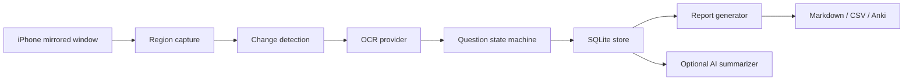

# Architecture

One Pass Med Review has two layers:

- A local Mac tool that observes, extracts, stores, and reports.
- A Codex skill that helps an AI agent operate the local tool and produce study reports.

The local tool is the source of truth. The skill should never be the only place where important logic lives.

## Capture Layer

The capture layer should only observe the selected mirrored iPhone region. It should avoid whole-screen capture unless the user explicitly chooses it.

Initial implementation:

- `CaptureRegion` describes the screen rectangle.
- `MacScreenCapture` wraps the macOS `screencapture` command.
- Future UI work should add interactive region selection.

## Change Detection

The app should not OCR every frame blindly. A frame is worth processing only when:

- The visual content changed enough.
- A minimum interval has passed.
- The user presses a hotkey that forces capture.

The MVP has a conservative byte-digest interface. Later versions can add perceptual hashing with Pillow or OpenCV.

## OCR Layer

OCR providers must be swappable. Likely options:

- Apple Vision via a small native helper.
- PaddleOCR for Chinese-heavy content.
- Tesseract as a lower-quality fallback.

The OCR layer should return text plus confidence and region metadata. It should not write screenshots by itself.

## Question State Machine

The state machine should learn the flow of the question app:

1. Question and options visible.
2. User selects an answer.
3. Result and explanation visible.
4. User navigates to the next question.

The MVP can use hotkeys to mark the outcome. Full automation can be added after collecting real screenshots.

## Storage

SQLite is enough for the first version:

- `sessions`: one practice run.
- `questions`: normalized question text, answers, explanation, outcome, summary.
- `evidence`: optional screenshots or other artifacts linked to a question.

The database stores structured learning artifacts, not a continuous screen recording.

## Reporting

Wrong questions should get a diagnostic summary:

- Why the selected answer was wrong.
- What the correct reasoning should be.
- Which memory hook or discriminating feature matters.

Correct questions should get a compact summary:

- One-line knowledge point.
- Optional tag.

## Future App Surface

The likely user-facing form is a small menu bar app:

- Start and stop capture.
- Select mirrored iPhone region.
- Mark correct, wrong, skip, and finish via hotkeys.
- Show today's report count and pending review items.
